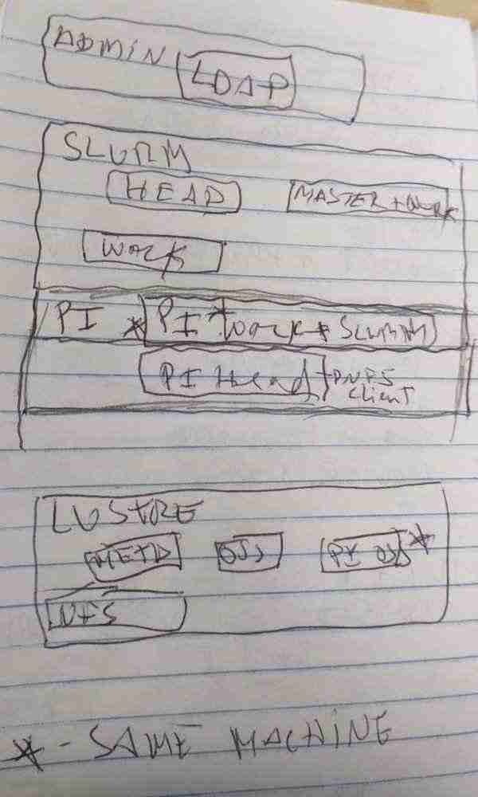

# Scientific Cluster

A virtual implementation of a scientific cluster based on LUSTRE and
SLURM. Made available top of QEMU.

This allows to test different architectures, components and policies.

It can also serve to maintain a virtual version of whatever is in
production (to test stuff, document, ...)

# Requirements

- An OS that can run QEMU
- QEMU
- 12 GB of memory
- ~30 GB of free disk space
- sshpass
- bash
- root access

Optional:

- VNC client

# Used components

- A Debian based Linux
- SLURM as a queuing manager
- LUSTRE as the cluster file system
- NFS to export externally
- LDAP (OpenLDAP) for user management

# Documentation

[Documentation is available.](http://cluster.tiago.org)

[Temporary stuff is here](temp.md)

# Architecture

The beautiful image above needs explanation.

# Why not Docker?

LUSTRE requires access to block volumes.

# Why not KVM (Kernel-based Virtual Machine)?

It should be easy to alter the QEMU commands (`-enable-kvm`) for this.
But, to ensure compatibility on Windows and Mac, this is not active.
